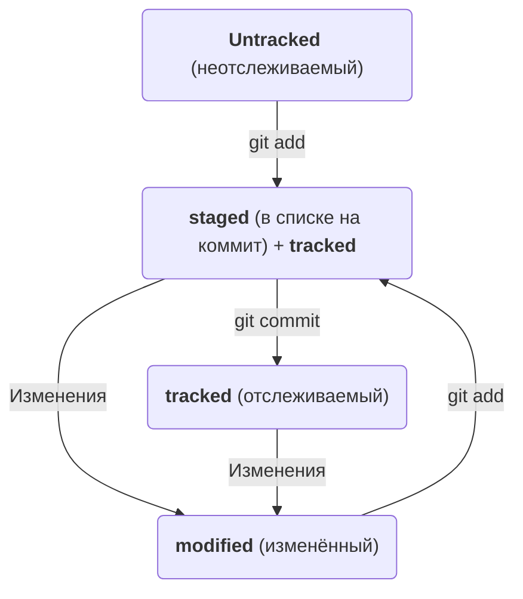

# Гайд по git и github

## Знакомство с git

### Что такое git и для чего он нужен?

**Git** - это система контроля версий программ, которая позволяет хранить, записывать, удалять историю изменений вашей программы.
Представьте, что вы написали программу по заказу, потом заказчик захотел что-нибудь новое. Вы внесли изменения и сохранили.
Но затем заказчик понял, что ошибся, и захотел, чтобы вы отменили изменения. Но предыдущая версия не сохранилась. И теперь
Вам придётся вспоминать, что вы меняли и переписывать программу. А с **git** вы смогли бы просто откатиться к предыдущей версии.

**Git** - это консольная программа. Другими словами, вы взаимодействуете с ней с помощью инструкций (команд), в отличии от **GUI** -
программ (с графическим интерфейсом), с которыми вы взаимодействуете с помощью мыши, кнопок и окон.  
Кроме того, **git** позволяет работать над проектом в команде, используя связь с удалённым репозиторием на какой-либо платформе (например, **GitHub**).

### Установка git

Скачайте и установите **git** с настройками по умолчанию с [официального сайта](https://git-scm.com/download/win) .
Запустите командную строку `bash.exe` (обычно находится в папке `C:\Program Files\Git\bin`). Теперь вы можете вводить различные команды для управления **git**.
Символ `$` в начале строки указывает на то, что вы можете вводить команду.

### Основные команды

Отметим, что мы установили командную строку `bash` вместе с `git`. Командная строка позволяет управлять файлами и папками (создание, перемещение, копирование, удаление).
Точно так же, как вы перемещаетесь по папкам с помощью нажатия клавишей мыши, можно перемещаться и в консоли. 
Для перехода к какой-либо папке введите `cd <имя папки>` и нажмите `Enter`. Папка должна быть в текущей директории. Но также можно указать абсолютный путь или путь относительно
текущей папки (в которой вы находитесь).

Чтобы узнать текущую рабочую папку введите `pwd` и нажмите `Enter` (в дальнейшем будем указывать только команду. Для её выполнения нужно нажимать `Enter`).
В последней версии **git** рабочая папка всегда отображается, так что команда `pwd` не понадобится.  
Домашняя папка (`C:/Users/user`) обозначается символов тильда `~`. Для перехода к ней: `cd ~`.  
Создайте в любом месте папку `My_projects`. Для этого перейдите в любую директорию и введите `mkdir My_projects`.  
Перейдите в неё и создайте файл `test.txt` с помощью команды `touch test.txt`. Можно создать сразу несколько файлов. Просто перечислите названия файлов
через пробел.
Создайте ещё одну папку `first-project` в этой папке и перейдите в неё.
Для перехода в родительскую папку (ту, что выше): `cd ..`. Двумя точками обозначается родительская папка. Если вы находились в папке `first-project`,
то после этой команды вы окажетесь в папке `My_projects`.  

В консоли также можно перемещать и копировать файлы. Скопируйте файл `test.txt` в папку `first-project` с помощью команды `cp test.txt first-project`.
Для перемещения файла используйте команду `mv`.
Для удаления файла используется команда `rm file.txt`, а для папки `rmdir`. Если папка не пустая, то **git** предупредит об этом, и команда не выполнится.
Если всё же необходимо удалить папку, содержащую что-либо, используйте команду `rm -r папка`. Однако помните, что удаление не перемещает объекты в корзину,
они удаляются безвозвратно.  
Чтобы посмотреть какие файлы и папки находятся в директории введите команду `ls`. Если нужно увидеть также скрытые файлы и папки, то команда `ls -a`.
При этом отобразятся папки `..` и `.` и файлы, названия которых начинаются с `.`. Символ `.` обозначает текущую папку и используется редко.  
Чтобы посмотреть содержимое файла используйте команду: `cat файл`. При этом, если файл не находится в текущей директории, нужно указать полный путь к нему,
например `cat c:\VASILIY\GIT\git_manual\readme.md`.

Если вы хотите ввести команду, которая ранее уже была введена, можно нажать стрелку Вверх. В консоли отобразится последняя команда. Если
ещё раз нажать вверх - предпоследняя, и тд. Если нажать вниз, то будем двигаться в другую сторону.  
Если название папки или файла слишком длинное, но вы помните начало, то начните вводить то, что помните, и нажмите `Tab`. Произойдёт автозаполнение.  
Также можно вводить несколько команд подряд, разделяя их символами `&&`. Например, создайте папку `second-projects` в папке `My_projects` и сразу
перейдите в неё, введя `mkdir second-projects && cd second-projects`.

Ну вот и всё! Теперь вы знаете как управлять файлами и папками. Перейдём к настройке `git`.

### Настройка git

Сейчас вы работали в одиночку, но в работе с командой, нужно знать, кто внёс изменения. Поэтому нужно указать своё имя и адрес электронной почты.  
Для установки своего имени введите команду `git config --global user.name "User Namovich"`.  
Для адреса: `git config --global user.email username@yandex.ru`. При этом не важно, в какой директории вы находитесь. Все глоабльные настройки 
хранятся в файле `.gitconfig` в домашней папке. Чтобы посмотреть содержимое, введите `cat ~/.gitconfig`. 

### Работа с репозиторием

Репозиторием можно назвать любую папку, содержащую файлы программы. Для того, чтобы **git** начал отслеживать изменения в файлах программы, 
необходимо её инициализировать. Пусть папка `first-project` станет вашим первым проектом. Перейдите в неё и введите команду `git init`. 
Теперь файлы папки будут отслеживаться. Создайте файл `todo.txt`, откройте его с помощью любого текстового редактора, запишите в него какое-нибудь
дело и сохраните. Введите команду `git status`, чтобы отобразить статус проекта. Вы увидите, что есть неотслеживаемые файлы `Untracked`.  
Введите команду `git add todo.txt`, чтобы начать отслеживать изменения файла `todo.txt` или `git add --all`, чтобы отслеживать изменения всех файлов. 
Теперь файл отслеживается, но изменения в нём ещё не сохранились. Чтобы записать изменения (сделать коммит), введите `git commit -m "Комментарий к записи"`.  
В консоли отобразится информация об изменениях в файле. Создайте ещё один файл, запишите в нём текст и сохраните. Затем снова сделайте коммит.  
Теперь введите команду `git log`. Вы увидите историю всех изменений - список ваших коммитов.

Ещё один этап пройден! Теперь вы знаете о **git** ещё больше. Но для командной работы этого недостаточно. Нужно поделиться своими изменениями. Для этого используются 
различные платформы. Мы будем использовать `GitHub`.

## Знакомство с GitHub

**GitHub** - это платформа для размещения удалённых репозиториев, а также своего рода социальная сеть для разработчиков. Она помогает миллионам пользователей
делиться своими идеями, присоединиться к чужому открытому проекту, а также даёт возможность работать над проектом в команде.

На **GitHub** можно создать репозитории различных типов:
+ приватный - доступ только у вас
+ командный - для вашей команды
+ публичный - виден всем пользователям

### Настройка аккаунта GitHub

Зарегистрируйтесь на [**GitHub**](https://github.com). Зайдите в профиль и нажмите на вкладку **Repositories**. Нажмите на зелёную кнопку **New**. 
Введите имя своего первого проекта `first-project`. Оно необязательно должно совпадать с названием локального проекта (на вашем компьютере). Не забудьте 
поставить галочку **Private** для создания приватного проекта. Теперь можно нажать кнопку **Create Repository**.  
Поздравляем вы создали свой первый репозиторий на **GitHub**! Теперь нужно связать его с локальным.

### Настройка безопасности соединения

Прежде чем связывать локальный и удалённый репозитории, нужно заиметь ключи безопасности, чтобы никто, кроме вас, не имел доступа к удалённому репозиторию.
Мы будем использовать сетевой протокол **SSH**, обеспечивающий безопасный обмен данными в сети. Он использует пары ключей: приватный и публичный. 
Первый используется для расшифровки данных, второй для шифрования. Публичный могут видеть все, а приватный должен быть известен только вам, иначе доступ 
к данным может получить другой человек.

Прежде чем сгенерировать ключи, убедитесь, что они ещё не были созданы. Перейдите в домашнюю директорию (`cd ~`) и введите команду `ls -la .ssh/`. 
Если ничего не отобразилось, значит папка пуста и всё хорошо. Если это не так и вы не создавали ключи, то удалите их все.  
Для генерации ключей введите команду `ssh-keygen -t ed25519 -C "электронная почта, к которой привязан ваш аккаунт на GitHub"`, где `ed25519` - алгоритм
шифрования. Если возникнет ошибка, попробуйте другой алгоритм, например, `rsa -b 4096`. Затем укажите место хранения ключей. По умолчанию будет предложена папка
`.ssh`. Для принятия нажмите `Enter`. Затем появится сообщение о создании кодовой фразы для ключей. Вы можете не придумывать её и нажать `Enter`.

Готово! Проверьте наличие ключей с помощью команды `ls -a ~/.ssh`. На экране отобразятся два файла, один из которых заканчивается на `.pub`. Это публичный ключ.
Скопируйте его содержимое в буфер обмена командой `clip < ~/.ssh/id_ed25519.pub`. 

Перейдите в настройки аккаунта **GitHub** (в правом верхнем углу). Затем слева в меню нажмите на `SSH and GPG keys`. Нажмите на `New SSH key`.  
В поле `Title` введите описание ключа, а в поле `Key` вставьте ключ из буфера обмена. Нажмите `Add SSH key`. 

Проверьте правильность ключа с помощью команды `ssh -T git@github.com`. Если в первый раз соединяетесь с **GitHub**, то выведется сообщение 
`The authenticity of host 'github.com (140.82.121.4)' can't be established. ED25519 key fingerprint is SHA256:+DiY3wvvV6TuJJhbpZisF/zLDA0zPMSvHdkr4UvCOqU. This key is not known by any other names. Are you sure you want to continue connecting (yes/no/[fingerprint])? `.
Это говорит о том, что **Git** не гарантирует, что **GitHub** является тем, за кого он себя выдаёт. Чтобы убедиться, что это сервер **GitHub**, перейдите
по [ссылке](https://docs.github.com/en/authentication/keeping-your-account-and-data-secure/githubs-ssh-key-fingerprints) и проверьте соответствие ключа
в сообщении с одним из ключей на странице. Если всё хорошо, то введите `yes` и нажмите `Enter`.

Поздравляем! Теперь ваш ключ привязан к **GitHub**.

### Синхронизация репозиториев

Перейдите на страницу удалённого репозитория, выберите тип SSH и скопируйте URL.
Перейдите в папку проекта и введите команду `git remote add origin <URL>`. Чтобы вставить текст из буфера в командную строку нажмите `Shift+Insert`.
Нажмите `Enter`. 

Убедитесь, что репозитории связаны: `git remote -v`. Должны отобразиться две строчки:
```bash
origin    git@github.com:%ИМЯ_АККАУНТА%/%ИМЯ-ПРОЕКТА%.git (fetch)
origin    git@github.com:%ИМЯ_АККАУНТА%/%ИМЯ-ПРОЕКТА%.git (push)
```

Мы связали репозитории. Теперь их нужно синхронизировать. Отправим коммиты в удалённый репозиторий. Сделать это можно с помощью команды 
`git push -u origin master`. Флаг `-u` нужен только для первого связывания. `origin` - это имя удалённого главного репозитория. Обычно он один.
`master` - имя главной ветки. Сейчас у нас всего одна (главная) ветка. Она создаётся автоматически. Также ветки могут разветвляться. Ветки можно представить
как параллельные временные шкалы, в которых происходили изменения. Кроме названия `master` также может использоваться `main`. 

В дальнейшем для связывания веток можно просто писать `git push`.

Зайдите в удалённый репозиторий. Должны появиться файлы проекта. Также возле каждого файла указываются комментарии к коммитам. Чуть выше и правее можно найти
кнопку `commits`. Здесь вы увидите все ваши коммиты. Нажмите на один из них. Вы увидите конкретные изменения, сделанные в файле.

Поздравляем! Теперь вы умеете делать коммиты и отправлять на удалённый репозиторий и ещё много всего полезного!

## Логи, хэши, HEAD, статусы файлов

### Хеш, лог и HEAD

Поговорим об информации, которая отображается после команды `git log`.  
После выполнения команды `git log` вы увидите следующую информацию:
+ Имя автора коммита и его адрес почты
+ Дата и время коммита
+ Описание коммита
+ Хэш коммита (код из 40 символов после слова `commit`)

**Хэш** (или **Хеш**) это уникальный идентификатор. Вся информация коммита, включая содержимое закоммиченного файла, дату и автора коммита, преобразуется в хеш.
Git заносит таблицу `хеш -> информация о коммите` в служебную папку `.git`. По хеш можно определить коммит. Хеш нужен, чтобы зашифровать данные о коммите.
Для этого git использует алгоритм **SHA-1**.

Также возле последнего коммита находится надпись `HEAD -> master` (или main). Это значит, что хеш последнего коммита хранится в файле `HEAD` в папке `.git`.
Точнее там хранится ссылка на него `refs/heads/master`. Если открыть файл `master`, вы увидите хеш последнего коммита.  
Хеш часто нужен в качестве параметра некоторым командам. А если нужно вставить хеш последнего коммита, то можно просто передать `HEAD`. Git поймёт.

Для вывода сокращённой истории коммитов используется команда `git log --oneline`. Отобразятся только первые несколько символов хеша и описание коммита.
Количество символов git подбирает таким образом, чтобы сокращённые хеши были уникальными. По такому хешу также можно идентифицировать коммит.

### Статусы файлов

Типичный жизненный цикл файлов в репозитории имеет следующие статусы:

+ `Untracked`
+ `tracked`
+ `staged`
+ `modified`

Эти статусы вы могли видеть после команды `git status`. Разберём их подробнее.

Статус `Untracked` появляется, когда вы добавили новый файл в проект, но ещё не применили команду `git add`. Это значит, что git знает о файле,
но ещё не отслеживает изменения в нём. Если применить к такому файлу команду `git add`, статус файла изменится на `staged` (подготовленный). То есть,
файл готов для коммита. Если его закоммитить и выполнить команду `git status`, то мы не увидим информацию о статусе данного файла. Это значит,
что он просто отслеживается, находится в состоянии `tracked` - противоположно `Untracked`. Если файл не имеет статус `Untracked`, это значит, что он имеет
статус `tracked` вне зависимости от того, был ли он изменён, подготовлен для коммита или уже закоммичен.  
Изменим закоммиченный файл. Тогда он перейдёт в статус `modified`. Это значит, что файл был изменён.

Но допустим, мы изменили файл, подготовили файл с помощью команды `git add`, но не закоммитили его, а изменили. Тогда мы увидим два статуса `modified`
одного и того же файла, но разных его версий: до команды `git add` и после изменения файла. Если снова применить команду `git add`, то для записи
будет подготовлена последняя версия файла.

Оба статуса `modified` и `staged` относятся к статусу `tracked`. Поскольку этот статус имеет более широкий смысл, чем `modified` и `staged`, обычно
его название упоминается, подразумевая, что файлы и так отслеживаются.

Схематически весь типичный жизненный цикл файла можно представить так:



### Оформлений сообщений к коммитам

Часто используется неопределённая форма глагола, например, "Добавить описание". Поэтому тоже так пиши :)


